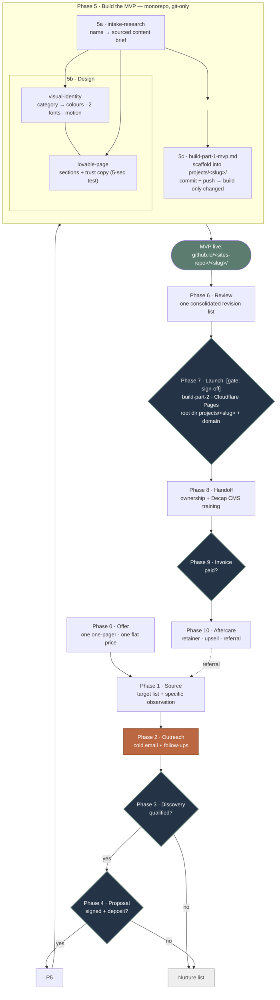

# What orchestration.md does — pipeline diagram

The full client engagement (Phases 0–10). `[gate]` = human decision required;
`[approve]` = no external send without explicit sign-off. Phase 5 fans out into
the three skills before the build.

**Autonomous mode** (framework owner authorizes): Phases 5a→6 may run without
pausing, but it **stops at the shareable MVP** — every external send, credential
entry, spend, and the Phase 7 go-live still require a human.
